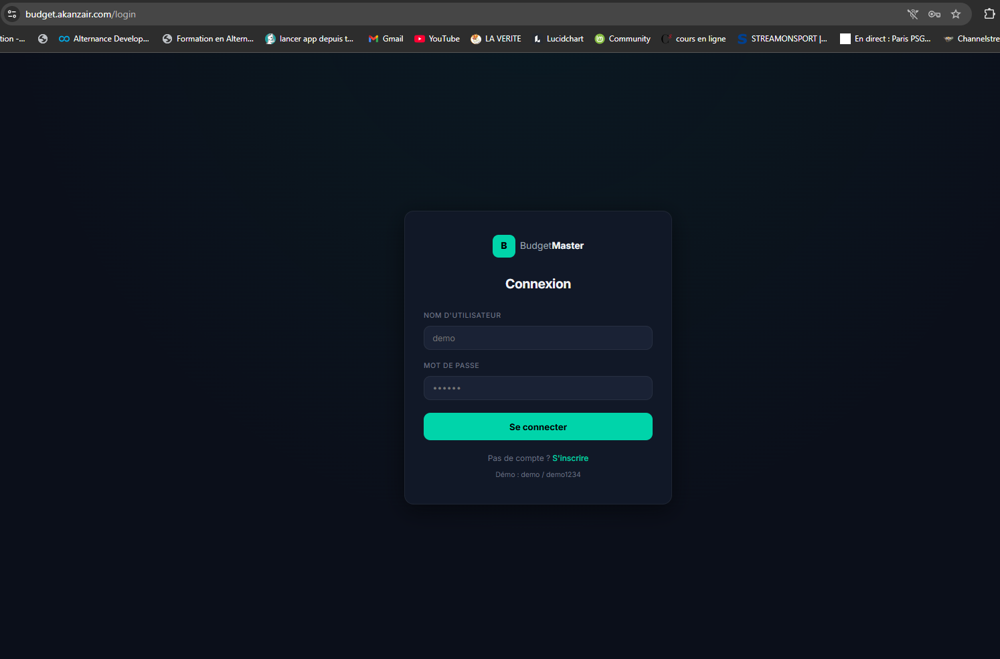
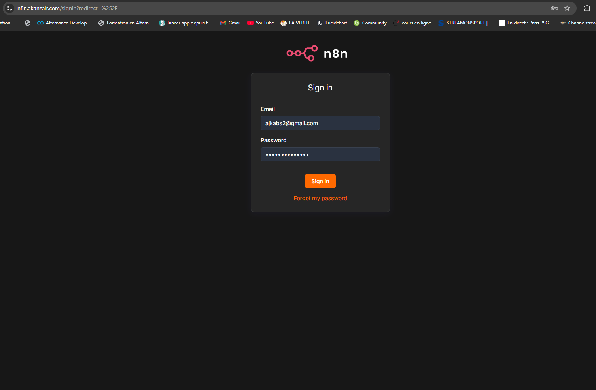
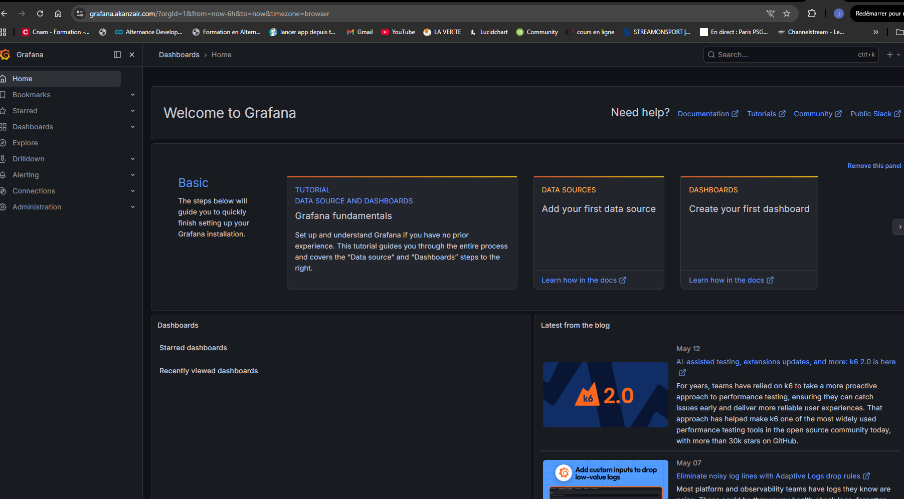

# 🏗️ Homelab DevOps — Infrastructure as Code

> Infrastructure complète : VMs Vagrant → Configuration Ansible → Docker → Reverse Proxy Nginx → Tunnel SSH → HTTPS → Applications en production sur akanzair.com


---

## 🎯 Objectif

Transformer un PC Windows en **plateforme DevOps complète**, capable d'héberger plusieurs applications accessibles sur internet via **akanzair.com**, en appliquant les principes professionnels :

- **Infrastructure as Code** — tout est versionné, reproductible, automatisé
- **Idempotence** — les playbooks Ansible peuvent être relancés sans risque
- **Séparation des responsabilités** — infra, services, secrets et apps clairement isolés
- **Exposition sécurisée** — tunnel SSH + HTTPS + reverse proxy Nginx
- **Observabilité** — monitoring via Grafana

---

## 🗺️ Architecture globale

```
Internet
    │
    ▼
akanzair.com (VPS — 72.62.21.162)
    │  Tunnel SSH -R (autossh) — ports 80 + 443
    ▼
srv-app (192.168.56.11) — Nginx reverse proxy + HTTPS
    ├── https://portainer.akanzair.com  → Portainer :9000
    ├── https://grafana.akanzair.com    → Grafana :3000
    ├── https://llm.akanzair.com        → Ollama :11434 (GPU)
    ├── https://n8n.akanzair.com        → n8n :5678
    └── https://budget.akanzair.com     → BudgetMaster :8000

srv-db (192.168.56.12) — PostgreSQL
    ├── base n8n
    └── base budget

PC Windows (hôte) — Ollama GPU (Quadro P2000)
```

---

## 🧰 Stack technique

| Outil | Rôle |
|-------|------|
| **Vagrant** | Provisionnement des VMs |
| **VirtualBox** | Hyperviseur |
| **Ansible** | Configuration automatique (6 rôles) |
| **Docker** | Conteneurisation |
| **Nginx** | Reverse proxy + HTTPS |
| **Certbot** | Certificats SSL Let's Encrypt |
| **autossh** | Tunnel SSH permanent (systemd) |
| **Portainer** | Gestion Docker |
| **Grafana** | Monitoring |
| **Ollama** | LLM local sur GPU |
| **n8n** | Automatisation de workflows |
| **PostgreSQL** | Base de données |

---

## ✅ Réalisations

- **6 rôles Ansible** réutilisables et idempotents
- **5 services HTTPS** déployés sur akanzair.com
- **2 bases PostgreSQL** (n8n + budget) sur srv-db
- **Backups automatiques** quotidiens (PostgreSQL + volumes Docker)
- **Tunnel SSH permanent** avec reconnexion automatique (autossh + systemd)

---

## 📚 Labs — Parcours pédagogique

| Lab | Objectif | Compétences |
|-----|----------|------------|
| [lab01](lab01-premiere-vm/) | Première VM Vagrant | Vagrant, provisioning |
| [lab02](lab02-multi-vm/) | Ansible + multi-VM | Inventaire, playbooks, rôles |
| [lab03](lab03-control-node/) | Control Node Ansible | Architecture, Docker, Nginx, PostgreSQL, Certbot |
| [lab04](lab04-tunnel-ssh/) | Exposition internet | SSH -R, GatewayPorts, autossh, systemd |

---

## 🔌 Focus Lab03 — Control Node Ansible

Le Control Node (`srv-ansible`) configure automatiquement tous les serveurs au démarrage.

### Structure Ansible

```
ansible/
├── inventory.ini
├── playbook.yml
└── roles/
    ├── common/         ← outils de base (tous les serveurs)
    ├── docker/         ← Docker + Compose
    ├── nginx/          ← reverse proxy
    ├── nodejs/         ← Node.js 18 (build frontend)
    ├── postgresql/     ← base de données
    └── certbot/        ← HTTPS Let's Encrypt
```

### Ordre des plays

```yaml
1. hosts: all        → rôle common   (outils universels)
2. hosts: appservers → docker + nginx (srv-app)
3. hosts: dbservers  → postgresql     (srv-db)
```

### Résultat `vagrant up`

```
srv-app  →  ok=24  changed=0  failed=0  ✅
srv-db   →  ok=10  changed=0  failed=0  ✅
```

---

## 🌐 Focus Lab04 — Tunnel SSH permanent

Objectif : exposer les services sur internet via un **tunnel SSH inversé** sécurisé.

```
Navigateur → akanzair.com → VPS (72.62.21.162) → SSH -R → srv-app → Nginx → service
```

### Étapes clés

1. **Configurer le VPS** — `GatewayPorts yes` + `ufw allow 443`
2. **Clé SSH sans passphrase** — `ssh-keygen -t ed25519 -f ~/.ssh/tunnel_key -N ""`
3. **Tunnel autossh** — `autossh -M 0 -N -i tunnel_key -R 80:localhost:80 -R 443:localhost:443`
4. **Service systemd** — redémarre automatiquement au boot

Certificats HTTPS via Certbot Let's Encrypt sur tous les sous-domaines.

---

## 🚀 Démarrage rapide

### Prérequis
- VirtualBox 7+
- Vagrant 2+
- Git

### Lancer l'infrastructure

```bash
git clone https://github.com/josuekabangu/homelab-devops-.git
cd homelab-devops-/lab03-control-node
vagrant up
```

---

## 📁 Structure du projet

```
homelab-devops/
├── lab01-premiere-vm/          ← VM simple + provisioning
├── lab02-multi-vm/             ← Ansible + 2 VMs
├── lab03-control-node/         ← Infrastructure complète
│   ├── Vagrantfile
│   ├── ansible/                ← 6 rôles Ansible
│   ├── nginx-configs/          ← configs reverse proxy (5 services)
│   └── systemd/                ← autossh-tunnel.service
├── lab04-tunnel-ssh/
├── services/                   ← Configs de production
│   ├── monitoring/             ← Portainer + Grafana
│   ├── n8n/                    ← Automatisation
│   └── budget/                 ← App budget (Django + React)
└── scripts/
    └── backup.sh               ← Backup PostgreSQL + volumes Docker
```

---

## 🌐 Services déployés

| Service | URL | Stack |
|---------|-----|-------|
| Portainer | [https://portainer.akanzair.com](https://portainer.akanzair.com) | Docker |
| Grafana | [https://grafana.akanzair.com](https://grafana.akanzair.com) | Docker |
| Ollama LLM | [https://llm.akanzair.com](https://llm.akanzair.com) | GPU local |
| n8n | [https://n8n.akanzair.com](https://n8n.akanzair.com) | Docker + PostgreSQL |
| BudgetMaster | [https://budget.akanzair.com](https://budget.akanzair.com) | Django + React + PostgreSQL |

---

## 📸 Screenshots

### BudgetMaster — App de gestion budgétaire


### n8n — Automatisation de workflows


### Grafana — Monitoring et visualisation


---

## 🔭 Prochaines étapes

- [ ] Prometheus + alerting
- [ ] CI/CD — GitLab pipeline
- [ ] Migration Kubernetes

---

## 👤 Auteur

**Josué Kabangu** — Ingénieur DevOps Junior  
Diplômé DataScientest • Formation DevOps Engineer (2024-2025)  
📧 ajkabs2@gmail.com  
🌐 [akanzair.com](https://akanzair.com)
